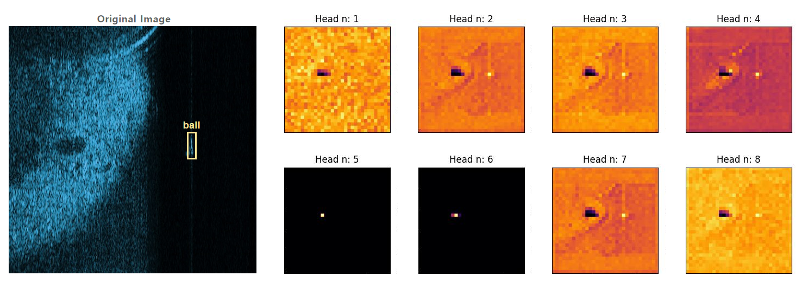
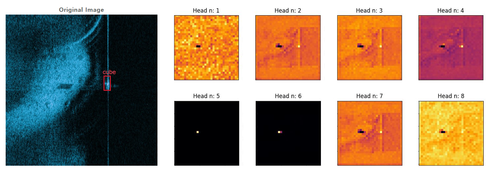

# CenterNet-Saccade: Enhancing Sonar Object Detection with Lightweight Global Feature Extraction

--------------------------------------------------------------
Updated on 2024.02.28.

In order to more intuitively verify the effectiveness of E-MHSA, we have updated the code that visualizes E-MHSA.



From these heat maps, we can see that E-MHSA, in addition to focusing on the target, also prominently attends to the shadows of the target, effectively distinguishing the shadows from the surrounding environment.

---------------------------------------------------------------------
Here is the original text.
## Introduction

Sonar imaging technology is widely used in the field of Marine and underwater monitoring because sound waves can be transmitted in the elastic medium of atmosphere and seawater without much interference. In underwater object detection, due to the unique characteristics of the monitored sonar image, and the target in the image is often accompanied by its shadow, we can use the relative relationship between the shadow and the target for detection. To make use of shadow information aided detection and realize the goal in sonar image accurate real-time detection, we put forward a network based on a light-weight module. By using the attention mechanism with global receptive field, the network can make the target pay attention to the shadow information in the global environment, and because of its exquisite design, the computation of the network is greatly reduced.  Specifically, we design a ShuffleBlock adapted to Hourglass to make the backbone network lighter. The idea of CNN dimension reduction is applied to MHSA to make it more efficient while paying attention to global features. Finally, the unreasonable distribution method of positive and negative samples by CenterNet is improved. The related simulation experiments are carried out using the proposed sonar object detection dataset. Among them, the experimental results further verify that our improved model has obvious advantages over many existing conventional deep learning models. Moreover, the real-time monitoring performance of our proposed model is more conducive to the implementation in the field of ocean monitoring.


## EXPERIMENT
To evaluate the proposed method, we conduct comprehensive experiments on underwater forward-looking sonar datasets provided by Pengcheng Laboratory. The experimental results show that, with PASCALVOC2012 as the evaluation standard, our model achieves good performance when the IoU threshold is 0.5-0.8. In the following subsections, we first present the details of the dataset and experimental implementation, and then we present the experimental results of a series of ablation experiments and comparison experiments performed on the forward-looking underwater sonar dataset.

### Sonar Image Dataset and Experimental Settings
Our experiment is based on [the sonar image dataset launched in Pengcheng Laboratory](https://pan.baidu.com/s/1n2868mAKC2pZ1Efy_oc1kQ?pwd=ctsc), which uses Tritech Gemini 1200I multi-beam forward-looking sonar as the data acquisition device, and the images are stored in BMP format. There are a total of 5000 images, including 3200 images in the training set, 800 images in the validation set, and 1000 images in the test set.
The model train and test environment in this paper are Linux Ubuntu version 16.04LTS, running on Inter-core I9-9900K, with TITAN RTX and 31.3GB memory. To ensure the stability and reproducibility of the experiment, we chose the version that is most compatible with hardware, namely the programming environment of Python 1.7.0, CUDA 10.2, and CUDNN 7.6.532, which will ensure the validity of our research results. After several experiments and comprehensive consideration, we adopt the following Settings to train the sonar dataset from scratch: The size of input resolution is fixed as 512Image512, the optimizer uses Adam, the basic learning rate is set as 0.0001, the number of training rounds is 150, and the training strategy of learning rate fixed step size decrease is adopted, each decrease is 1/10 of the original, and the number of decreasing rounds is 80 and 110 respectively. To enhance the diversity of data, we used random vertical flipping and random horizontal flipping as data preprocessing. In addition, the classic algorithms such as SSD in the comparative experiments are based on the open-source framework MMDetection. These experiments use the same sonar image dataset and their evaluation metric is Pascal VOC2012.

### MHSA Experimentson
Comparison of accuracy (IoU threshold =0.7), parameter number, MAC, and speed based on original CenterNet for different [MHSA](./nets/attn.py) methods.

| Method            | AP(%)   | Params  | Time(s/1e-3)  |
|:-----------------:|:-------:|:-------:|:-------------:|
| Base              | 75.77   | 443136  | 109.30        |
| Grouping Of FNN   | 75.53   | 14592   | 109.04        |
| Conv 1*1          | 75.70   | 443136  | 90.33         |
| Conv 3*3          | 75.95   | 1769984 | 34.44         |

### Ablation Study
The average accuracy of each model for different IoU under PASCAL VOC2012 standard


| Method                    | AP_50(%)   | AP_60(%)   | AP_70(%)   | AP_80(%)   | Time(s) | Mem(GB)  |
|:-------------------------:|:----------:|:----------:|:----------:|:----------:|:-------:|:--------:|
| Base CenterNet            | 98.5       | 92.8       | 72.1       | 24.6       | 0.376   | 3.3      |
| CenterNet(E-MHSA)         | 95.6       | 94.8       | 77.3       | 28.8       | 0.600   | 3.5      |
| CenterNet (L-Hourglass)   | 98.3       | 90.2       | 71.4       | 23.9       | 0.102   | 1.4      |
| CenterNet-Saccade         | 97.7       | 94.2       | 76.5       | 26.7       | 0.156   | 1.7      |

For more experimental details and comparative experiments check the paper.

## Train and Test

Before training, it is necessary to set the path of the dataset, the path for storing parameters and logs, as well as the type and quantity of detected targets in [train.py](./train.py) and [pascal.py](./datasets/pascal.py)

```bash
python ./train.py
```
Similarly, the same goes for the [test](./test.py).

